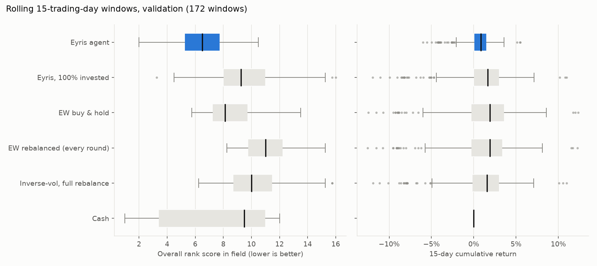
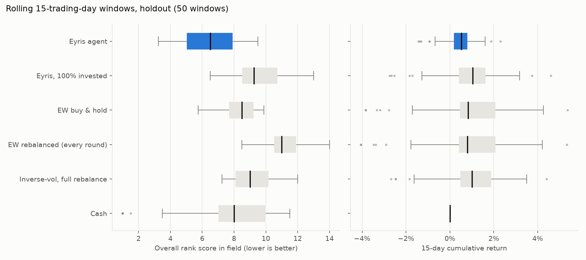
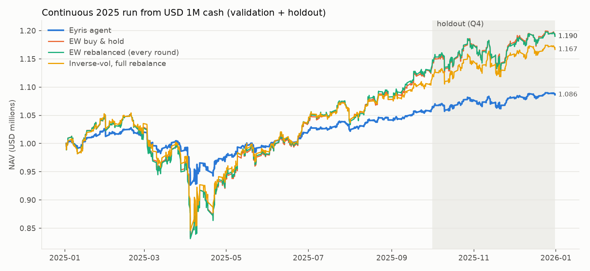

# Backtest report

Generated by `python scripts/report.py`. Selected configuration (`models/params.json`):

```json
{
 "risk_method": "invvol",
 "lookback_days": 40,
 "stock_cap": 0.1,
 "gross": 0.5,
 "use_alpha": false,
 "tilt": 0.0,
 "lam": 0.25,
 "band": 0.05,
 "min_trade": 0.002
}
```

Baseline selected by scripts/tune.py (validation 2025-01..09). Alpha decision: see reports/alpha_experiment.json.

## How to read this

- Every 15-trading-day window (the Official Competition length, 105 rounds) is
  simulated from USD 1,000,000 cash with 0.1% fees, at the competition's exact
  rounds: 09:30 open, then HH:30 fills proxied by the hourly bar's (open+close)/2.
- Metrics follow the official definitions (decision-period Sharpe x sqrt(1764),
  drawdown including 16:00 closes, turnover = mean traded notional / NAV
  including the initial allocation).
- **Rank** is the official overall rank score (mean of the four metric ranks)
  against a reference field of 23 strategies standing in for other
  teams: cash, equal-weight variants, inverse-vol, the starter-kit momentum
  agent, 20-day momentum, 10 random buy-and-hold portfolios and 5 random
  daily-reshuffled portfolios. Lower is better. The real field is unknown, so
  absolute ranks are indicative; comparisons between rows are what matter.
- Periods: train 2021-2024 (950 windows), validation
  2025-01..09 (172 windows, used for tuning), holdout 2025-Q4
  (50 windows, evaluated once). The dataset ends 2025-12-31, so there is no
  January 2026 data.

## Validation (2025-01-02 .. 2025-09-30)

| Strategy | Median rank (of 24) | Worst rank | Median rank, active field (of 13) | Median 15d return | Worst 15d return | Median Sharpe | Median MDD | Worst MDD | Median turnover |
|---|---:|---:|---:|---:|---:|---:|---:|---:|---:|
| Eyris agent | 6.50 | 10.50 | 3.50 | +0.86% | -5.99% | 2.80 | 1.30% | 7.94% | 0.0048 |
| Eyris, 100% invested | 9.25 | 16.00 | 3.75 | +1.66% | -11.96% | 2.76 | 2.57% | 15.66% | 0.0097 |
| EW buy & hold | 8.12 | 13.50 | 3.75 | +1.89% | -12.48% | 2.74 | 2.75% | 16.68% | 0.0095 |
| EW rebalanced (every round) | 11.00 | 15.25 | 4.25 | +1.91% | -12.55% | 2.63 | 2.75% | 16.74% | 0.0129 |
| Inverse-vol, full rebalance | 10.00 | 15.75 | 3.75 | +1.55% | -11.89% | 2.74 | 2.54% | 15.65% | 0.0160 |
| Cash | 9.50 | 12.00 | 4.38 | +0.00% | +0.00% | 0.00 | 0.00% | 0.00% | 0.0000 |



## Holdout (2025-Q4, untouched during tuning)

| Strategy | Median rank (of 24) | Worst rank | Median rank, active field (of 13) | Median 15d return | Worst 15d return | Median Sharpe | Median MDD | Worst MDD | Median turnover |
|---|---:|---:|---:|---:|---:|---:|---:|---:|---:|
| Eyris agent | 6.50 | 9.50 | 3.38 | +0.52% | -1.44% | 2.03 | 1.33% | 2.09% | 0.0048 |
| Eyris, 100% invested | 9.25 | 13.00 | 3.75 | +1.04% | -2.75% | 2.09 | 2.65% | 4.13% | 0.0098 |
| EW buy & hold | 8.50 | 9.88 | 4.00 | +0.83% | -3.84% | 1.81 | 2.95% | 4.83% | 0.0095 |
| EW rebalanced (every round) | 11.00 | 14.00 | 4.50 | +0.79% | -4.06% | 1.81 | 2.96% | 4.87% | 0.0130 |
| Inverse-vol, full rebalance | 9.00 | 12.00 | 3.62 | +1.01% | -2.69% | 2.07 | 2.64% | 4.08% | 0.0162 |
| Cash | 8.00 | 11.50 | 4.00 | +0.00% | +0.00% | 0.00 | 0.00% | 0.00% | 0.0000 |



## Train (2021-2024, out-of-sample for the baseline parameters' selection)

| Strategy | Median rank (of 24) | Worst rank | Median rank, active field (of 13) | Median 15d return | Worst 15d return | Median Sharpe | Median MDD | Worst MDD | Median turnover |
|---|---:|---:|---:|---:|---:|---:|---:|---:|---:|
| Eyris agent | 6.50 | 11.50 | 3.50 | +0.44% | -5.97% | 1.57 | 1.43% | 6.19% | 0.0048 |
| Eyris, 100% invested | 9.88 | 18.00 | 4.00 | +0.87% | -11.92% | 1.60 | 2.83% | 12.33% | 0.0097 |
| EW buy & hold | 8.50 | 13.50 | 4.00 | +0.97% | -13.02% | 1.68 | 2.97% | 13.24% | 0.0095 |
| EW rebalanced (every round) | 11.50 | 16.00 | 4.75 | +0.93% | -13.26% | 1.56 | 3.00% | 13.31% | 0.0126 |
| Inverse-vol, full rebalance | 10.50 | 17.50 | 4.50 | +0.86% | -12.11% | 1.58 | 2.86% | 12.55% | 0.0157 |
| Cash | 8.75 | 12.00 | 4.00 | +0.00% | +0.00% | 0.00 | 0.00% | 0.00% | 0.0000 |

## Equity curve



| Strategy | Return | Sharpe | Max drawdown | Avg turnover / round |
|---|---:|---:|---:|---:|
| Eyris agent | +8.64% | 1.24 | 9.90% | 0.0003 |
| EW buy & hold | +19.01% | 1.20 | 20.85% | 0.0006 |
| EW rebalanced (every round) | +18.99% | 1.17 | 21.12% | 0.0040 |
| Inverse-vol, full rebalance | +16.67% | 1.16 | 19.76% | 0.0073 |

## Execution-price sensitivity (validation)

| Fill proxy for HH:30 executions | Median rank | Median 15d return | Median turnover |
|---|---:|---:|---:|
| open | 6.75 | +0.86% | 0.0048 |
| mid | 6.50 | +0.86% | 0.0048 |
| close | 6.75 | +0.86% | 0.0048 |

## Alpha tilt

Best alpha variant: horizon 7 rounds, tilt 0.1, band 0.1 -> median rank 6.50 vs baseline 6.50. Recommendation: **drop** (details in `alpha_experiment.md`).
